<div align="center">




&nbsp;

`✧ ･ﾟ: *✧ ･ﾟ:*　　*:･ﾟ✧*:･ﾟ✧`

</div>

---

## ✿ about me

```
╭────────────────────────────────────────────╮
│  name     ♡  sinem karaaslan               │
│  school   ♡  computer engineering, Arel    │
│  doing    ♡  part-time engineer @ Kuika    │
│  stack    ♡  react · C# · python           │
│  loves    ♡  LLMs, RAG, product thinking,  │
│              shipping things people use    │
│  fueled   ♡  by coffee & spite for bugs    │
╰────────────────────────────────────────────╯
```

- 🌸 i work on a **low-code / AI platform** — React on the frontend, C# on the backend
- 🪄 currently figuring out: the .NET ecosystem properly, RAG beyond just calling an API, and being a PO without slowing the team down
- 🫂 Product Owner on **KampüsDestek**, a peer support platform — 5-person scrum team, and some of the backend too
- 💬 ask me about: what's worth shipping, what to track, and how to tell if it actually worked

---

## ✦ my pet (she lives here now)

<div align="center">



<sub><i>this is <b>Pixel</b> — she reviews all my PRs by sitting on them ♡</i></sub>

</div>

---

## ✿ things i use

<div align="center">


</div>

---

## ✧ things i built

- 🎡 **FilmÇark** — Letterboxd-ish film platform with a spinning wheel for when you can't decide. ASP.NET Core 8 MVC · EF Core · TMDB API
- 🫂 **KampüsDestek** — peer support platform for students. PO + some backend (Flask, PostgreSQL)
- 📄 **PDF Chatbot** — small RAG project, built to actually understand embeddings
- 🎧 **Music Genre Classifier** — CNN on mel-spectrograms, 10 genres, transfer learning + augmentation
- 🚀 **NASA Space Dashboard** — when the Mars Rover endpoint broke, I rebuilt that section as a static info hub instead of shipping something broken

---

## ✿ a cat eats my commits

<div align="center">



<sub><i>most of my work lives in private repos, so the real graph keeps quiet about it.<br/>this one doesn't, and it has a cat. ♡</i></sub>

</div>

---

<div align="center">

### ✧ ･ﾟ thanks for stopping by ･ﾟ ✧

<sub>if you scrolled this far, Pixel says you have to pet her</sub>

<br/>

`(=^･ω･^=)`  `♡`  `(=^･ｪ･^=)`  `♡`  `ฅ^•ﻌ•^ฅ`

<br/>


</div>